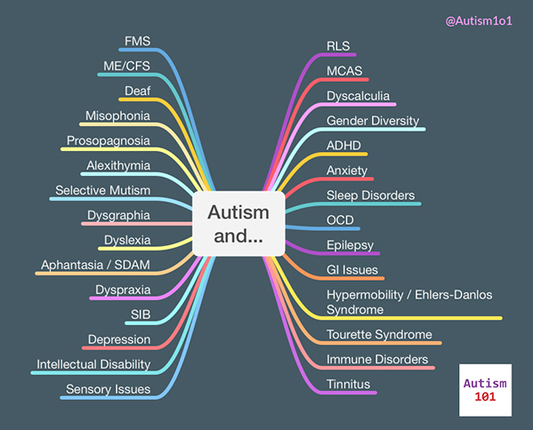

+++
weight = 40
+++

## The "Double Whammy"
Aging and Autism interact bidirectionally:

* <strong>Aging processes</strong> (cognitive slowing, physical decline) can exacerbate autistic traits (sensory sensitivity, executive dysfunction).
* <strong>A lifetime of autistic stress</strong> (masking, sensory overload) may accelerate certain aging processes (health outcomes).

<strong>Key Concept:</strong> Reduced physiological and cognitive "bandwidth" to cope with stressors.

--- 

## Healthcare Barriers
* <strong>Communication Mismatches:</strong> Difficulty describing pain accurately; doctors misinterpreting flat affect or direct/blunt communication as non-compliance.
* <strong>Sensory Overload in Clinics:</strong> Bright lights, waiting rooms, and physical exams can lead to care avoidance.
* <strong>Co-occurring Conditions:</strong> Higher rates of anxiety, depression, GI issues, and sleep disorders often complicate geriatric care.

--- 

## Sensory and Cognitive Shifts
* <strong>Sensory:</strong> Natural age-related hearing/vision loss *combined* with autistic sensory processing differences can be overwhelming and disorienting.
* <strong>Executive Function:</strong> Aging impacts working memory and processing speed. For an autistic brain already working hard to organize, this can lead to significant functional decline quickly.
* <strong>Burnout Recovery:</strong> Bouncing back from sensory or social overload takes significantly longer at 60 than at 30.

--- 

## Shrinking Support Networks
* <strong>Loss of "Buffers":</strong> Many older autistics relied heavily on parents or a spouse to navigate the social world. Losing them is catastrophic.
* <strong>The "Group Home" Fear:</strong> Intense fear of losing independence and ending up in communal senior living, which is rarely sensory-friendly.
* <strong>Financial Vulnerability:</strong> Due to lifetime underemployment (common in the lost generation), financial resources for aging may be scarce.

---

## Co-occuring Conditions

* Will likely have other issues 
* Ex. ADHD may occur in 40% to 70% of autistic people <a href="#/15">[3]</a>

--- 

<section class="left-aligned-section">
<h2>The "Autistic Advantage" in Aging</h2>

It isn't all negative. Many older autistic adults possess unique resilience factors:

<ul>
<li><strong>Solitude as Strength:</strong> Often better equipped to handle alone time than neurotypical peers.</li>
<li><strong>Passionate Interests:</strong> "Special Interests" provide deep engagement, cognitive protection, and joy in retirement.</li>
<li><strong>Detail Orientation:</strong> Excellent at managing complex medication schedules or financial planning (if executive function permits).</li>
<li><strong>Non-Conformity:</strong> Less pressure to keep up with societal expectations of "how to act" at 70.</li>
</ul>
</section>

