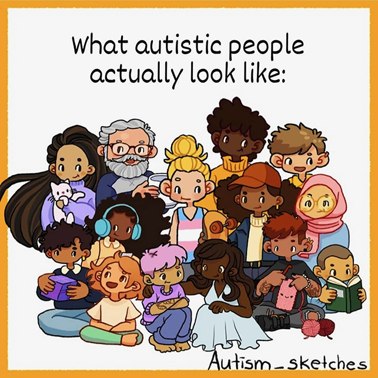
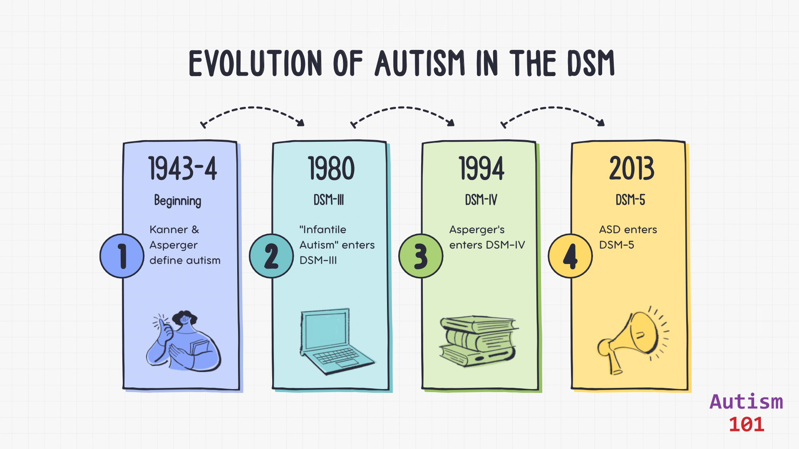

+++
weight = 10
+++

## What Is Autism?

- Autism is a neurological and developmental difference
- It is naturally occuring
- It is not a disease 😷
- It can't be cured
- It has always existed

 
 

---

## Autistic People Differ

> "If you have met one autistic person  
> you have met one autistic person." <a href="#/26">[1]</a>

— Dr. Stephen Shore (autism advocate)

---

---

## Why Are We Talking About This Now?

- The "Graying" of the population globally.<a href="#/26">[2]</a>

- The first generation diagnosed as children are now entering middle age.<a href="#/26">[3]</a>
- The massive, previously unidentified group of people aged 50-80+.<a href="#/26">[4]</a>
- A critical lack of research and services for autistic seniors.<a href="#/26">[5]</a>

    <aside class="notes">
        Mention here that gerontology and neurodivergence research have historically been siloed. We are just now building the bridge.
    </aside>

---

## The Timeline of Invisibility

Why didn't they get diagnosed 40 years ago?

---

---

- <strong>1943-1944:</strong> Kanner & Asperger define the condition (mostly in children).
- <strong>1980 (DSM-III):</strong> "Infantile Autism" enters the DSM. Strict criteria.
- <strong>1994 (DSM-IV):</strong> Asperger's Syndrome added. The beginning of broader recognition.
- <strong>2013 (DSM-5):</strong> ASD becomes a spectrum; allows for adult diagnosis more easily.

> "We aren't part of an epidemic.  
> We are part of an awakening." 

— Autism-101

---

<section class="left-aligned-section">
    <h2>Who Are "Older Autistic Adults"?</h2>
    
Today, we are focusing generally on those 50+, but specifically two groups:

<ul>
<li><strong>Diagnosed early:</strong> now aging.</li>
<li><strong>"Lost Generation":</strong> diagnosed late in life, or still undiagnosed.</li>
</ul>

</section>

