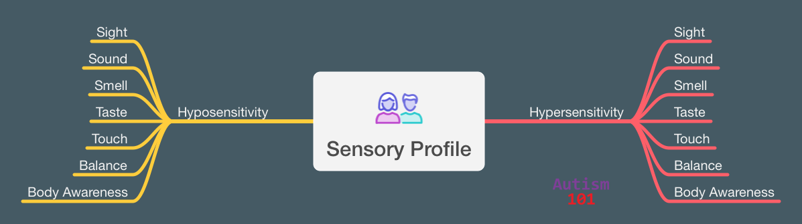

+++
weight = 30
+++

## Sensory Differences 

> "Processing everyday sensory information 
> can be difficult for autistic people. 
> Any of their senses may be over- or under-sensitive, 
> or both, at different times." <a href="#/27">[7]</a>

— NAS 

---

## Sensory Profiles

* Unique to individual
* Hyposensitive, hypersensitive, or both
* Can change day to day
* Are well outside the normal ranges
* Impacts what we like to do

---

## Do Sensory Issues "Mellow" With Age?

__Short Answer: No.__ They often become __harder__ to manage.

* Older autistic adults report lower ability to "cope" with sensory input. The energy used to "mask" or "push through" in their 30s is gone.<a href="#/27">[8]</a>
* Age-related hearing/vision loss increases cognitive load. The brain works harder to interpret data, leading to faster overload.<a href="#/27">[8]</a>
* After age 40, the autistic nervous system may regulate stress less efficiently, making sensory triggers feel more physically painful.<a href="#/27">[8]</a>

