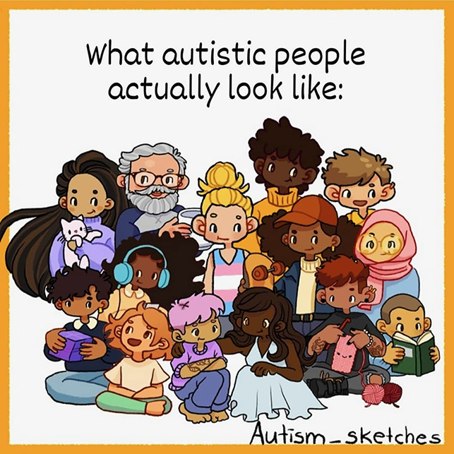

+++
weight = 10
+++

## What Is Autism?

- Autism is a neurological and developmental difference
- It is naturally occuring
- It is not a disease 😷
- It can't be cured
- It has always existed

 
 

---

## Autistic People Differ

> "If you have met one autistic person  
> you have met one autistic person." <a href="#/15">[1]</a>

— Dr. Stephen Shore (autism advocate)

---

