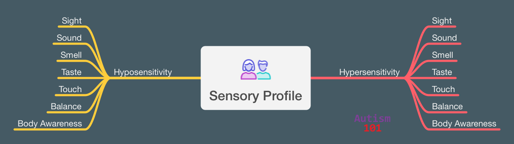

+++
weight = 20
+++

## Sensory Differences

> "Processing everyday sensory information 
> can be difficult for autistic people. 
> Any of their senses may be over- or under-sensitive, 
> or both, at different times." 2

— National Autistic Society

***

## Sensory Profiles

* Unique to individual
* Hyposensitive, hypersensitive, or both
* Can change day to day
* Are well outside the normal ranges
* Impacts what we like to do

