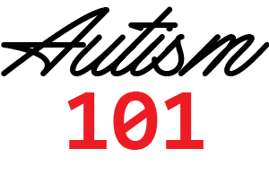

+++
title = "NTG Webinar: Autism and Aging"
description = "What Organizations Need To Know About Aging In Adults With Autism"
outputs = ["Reveal"]
[reveal_hugo]
custom_theme = "reveal-hugo/themes/robot-lung.css"
margin = 0.2
highlight_theme = "color-brewer"
transition = "slide"
transition_speed = "fast"
[reveal_hugo.templates.hotpink]
class = "hotpink"
background = "#FF4081"
+++

**What Organizations Need To Know About Aging In Adults With Autism**

*Part of the Essentials of Dementia Capable Care Series*

Jeff Owens - contact[AT]autism-101.com