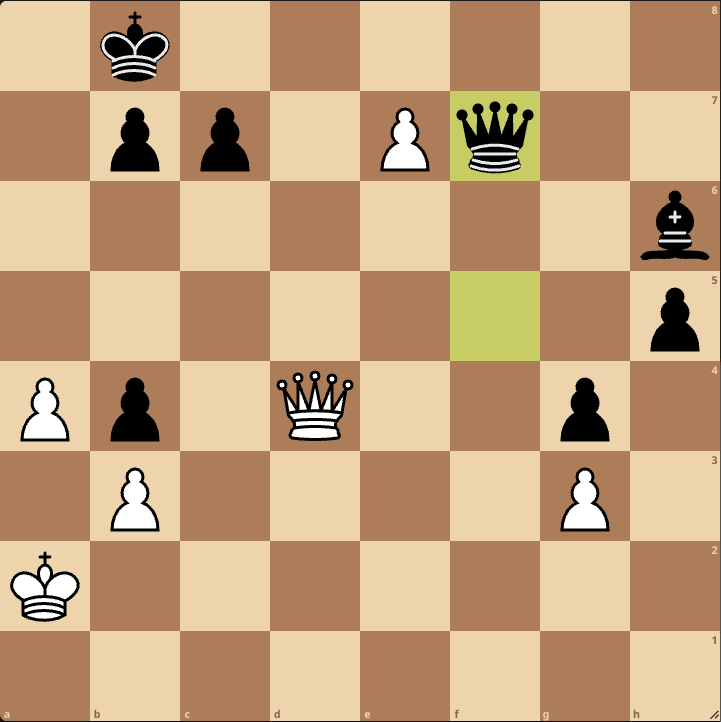

+++
weight = 5
+++

## Who Are You?

- I'm Jeff Owens
- I'm a late diagnosed autistic person

---
I grew up feeling like an alien, inhabiting the wrong planet.

<aside class="notes">
  I also like detective shows because they get to solve puzzles, and they pickup on patterns.
</aside>

---

Which is why Spock became my favorite TV character.

<aside class="notes">
  I also like detective shows because they get to solve puzzles, and they pickup on patterns.
</aside>

<aside class="notes">
  I play chess because I like the patterns in it and solving puzzles.
</aside>

---
Spock likes cats.

<aside class="notes">
  I also like detective shows because they get to solve puzzles, and they pickup on patterns.
</aside>

---
And I like cats. (Ginger & Jet)

<aside class="notes">
  I also like detective shows because they get to solve puzzles, and they pickup on patterns.
</aside>

---
Spock likes chess.

<aside class="notes">
  I also like detective shows because they get to solve puzzles, and they pickup on patterns.
</aside>

---
And I like chess.

<aside class="notes">
  I also like detective shows because they get to solve puzzles, and they pickup on patterns.
</aside>

---
Spock likes computers, and so do I.

<aside class="notes">
  I also like detective shows because they get to solve puzzles, and they pickup on patterns.
</aside>

---
Spock likes music.

<aside class="notes">
  I also like detective shows because they get to solve puzzles, and they pickup on patterns.
</aside>

---
And so do I.

<aside class="notes">
  I also like detective shows because they get to solve puzzles, and they pickup on patterns.
</aside>

---
Spock has trouble understanding his emotions, and so do I.

<aside class="notes">
  I also like detective shows because they get to solve puzzles, and they pickup on patterns.
</aside>

---
Last year I received the "Live Long and Prosper" award.

<aside class="notes">
  I also like detective shows because they get to solve puzzles, and they pickup on patterns.
</aside>

---
Which was a great honour for me.

<aside class="notes">
  I also like detective shows because they get to solve puzzles, and they pickup on patterns.
</aside>

---
I drink coffee from my Star Trek mug every day.

<aside class="notes">
  I also like detective shows because they get to solve puzzles, and they pickup on patterns.
</aside>

---
And I use a Star Trek mousepad.

<aside class="notes">
  I also like detective shows because they get to solve puzzles, and they pickup on patterns.
</aside>

---
I like detective shows.

<aside class="notes">
  I also like detective shows because they get to solve puzzles, and they pickup on patterns.
</aside>

---

<aside class="notes">
  I also like detective shows because they get to solve puzzles, and they pickup on patterns.
</aside>

---
I love music composed by John Williams.

<aside class="notes">
  I also like detective shows because they get to solve puzzles, and they pickup on patterns.
</aside>

---
I run the Autism-101.com website.

<aside class="notes">
  I also like detective shows because they get to solve puzzles, and they pickup on patterns.
</aside>

---
As well as AutismInTheMedia.com.

<aside class="notes">
  I also like detective shows because they get to solve puzzles, and they pickup on patterns.
</aside>

