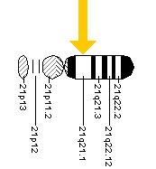
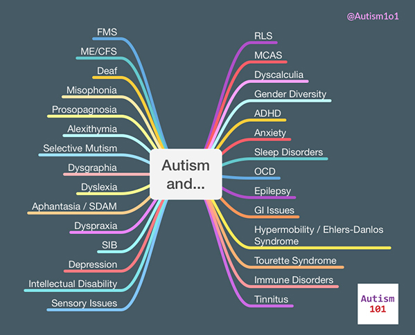

+++
weight = 15
+++

###  and Intellectual Disability (IDD)
- **Overlap:** A significant portion of autistic adults also have a diagnosis of Intellectual Disability (30-40%).<a href="#/55">[8]</a>
- **Complexity:** Aging impacts functional skills differently when neurodivergence and IDD co-occur.<a href="#/55">[9]</a>
- **Support Needs:** High support needs may shift from educational/vocational to clinical and residential as the person ages.<a href="#/55">[10]</a>

<aside class="notes">
  Functional skills, like daily living tasks, do not just decline in a linear fashion.
  The Down Syndrome-ASD Profile
</aside>

---

### The DS-ASD Profile
- **Down Syndrome and  (DS-ASD)**
Individuals with Down Syndrome have a significantly higher prevalence of  than the general population.<a href="#/56">[11]</a>
- **Unique Presentation:** Social-communication challenges may be more pronounced than in peers with Down Syndrome alone.<a href="#/56">[12]</a>
- **Organizational Insight:** Care protocols must be tailored to both the genetic profile and the autistic sensory profile.<a href="#/56">[13]</a>

<aside class="notes">
  Alzheimer’s and Dementia Risks
</aside>

---

### APP Gene On Chromosome 21
Location of the APP gene on chromosome 21 in humans

---

### Alzheimer’s and Dementia Risks
- **Heightened Risk:** Autistic adults with IDD have nearly **3 times** the risk of early-onset Alzheimer’s compared to non-autistic peers.<a href="#/56">[14]</a>
- **Down Syndrome Link:** Due to the APP gene on chromosome 21, nearly all adults with Down Syndrome exhibit Alzheimer's pathology by age 40.<a href="#/56">[15]</a>
- **Diagnostic Overshadowing:** New dementia symptoms are often wrongly attributed to "just their " or "typical IDD behavior".<a href="#/57">[16]</a>

---

### Co-occuring Conditions

* Will likely have other issues 
* Ex. ADHD may occur in 40% or more of autistic people <a href="#/57">[17]</a>
