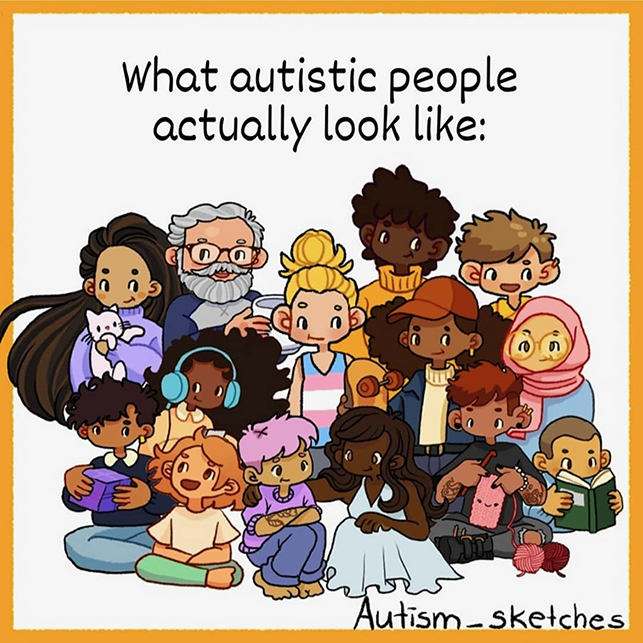
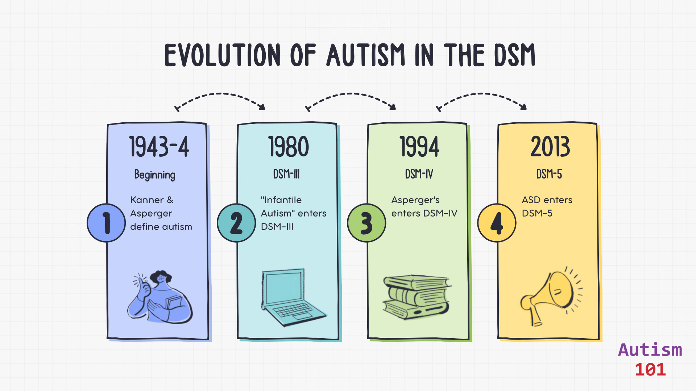
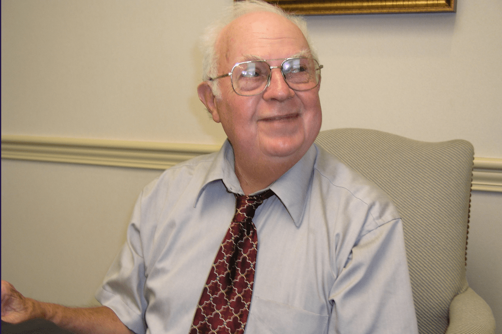

+++
weight = 10
+++

### What Is ?

-  is a neurological and developmental difference
- It is naturally occurring
- It is not a disease 😷
- It can't be cured
- It has always existed

 
 

<aside class="notes">
  In the news a lot now. No epidemic. Better diagnostic tools and training. Broadening of the definition, more awareness through social media.
</aside>

---

### Autistic People Differ

> "If you have met one autistic person  
> you have met one autistic person." <a href="#/54">[1]</a>

— Dr. Stephen Shore ( advocate)

<aside class="notes">
  We each present our autism differently. We might have different co-occurring conditions.
</aside>

---

<aside class="notes">
  You can't tell by looking at a picture of someone whether they are autistic or not. Autistic kids grow up to be autistic adults. Why now?
</aside>

---

### Why Is This Important Now?

- The "Graying" of the population globally.<a href="#/54">[2]</a>

- The first generation diagnosed as children are now entering middle age.<a href="#/54">[3]</a>
- The massive, previously unidentified group of people aged 50-80+.<a href="#/54">[4]</a>
- A critical lack of research and services for autistic seniors.<a href="#/54">[5]</a>

<aside class="notes">
  Between 2015 and 2050, world's population over 60 will nearly double to 22%. Mention here that gerontology and neurodivergence research have historically been siloed. We are just now building the bridge.
</aside>

---

### The Timeline of Invisibility

Why didn't they get diagnosed 40 years ago?

---

<aside class="notes">
  The Soviet child psychiatrist Grunya Sukhareva really discovered and described autism nearly two decades before Leo Kanner. She gets overlooked by Western history due to a mix of geopolitics, language barriers, name misspellings, and institutional bias.
</aside>

---

- <strong>1943-1944:</strong> Kanner & Asperger define the condition (mostly in children).
- <strong>1980 (DSM-III):</strong> "Infantile " enters the DSM. Strict criteria.
- <strong>1994 (DSM-IV):</strong> Asperger's Syndrome added. The beginning of broader recognition.
- <strong>2013 (DSM-5):</strong> ASD becomes a spectrum; allows for adult diagnosis more easily.

> "We aren't part of an epidemic.  
> We are part of an awakening." 

— Autism-101

---

### ASD Support Levels

- **Level 1** - requires support
- **Level 2** - requires substantial support
- **Level 3** - requires very substantial support

<aside class="notes">
  Support levels can change over time.
</aside>

---

### First Person Diagnosed in U.S.
**Donald Triplett** - was diagnosed by Leo Kanner in 1943

<aside class="notes">
  Donald was known for some of his savant abilities. 
</aside>

---

### Donald Triplett

- <strong>Born:</strong> Forest, Mississippi in 1933.
- <strong>College:</strong> he graduated with a bachelor's degree in mathematics and French.
- <strong>American Banker:</strong> he worked for 65 years at a local bank.
- <strong>Music:</strong> he had perfect pitch.
- <strong>Savant:</strong> he could do rapid mental multiplication.
- <strong>Book:</strong> featured in the book, _In a Different Key_, later adopted into a documentary.

<aside class="notes">
  Who are older autistic adults? 
</aside>

---

### Who Are "Older Autistic Adults"?
Today, we are focusing on those 50+, but specifically two groups:

- **Diagnosed early:** now aging.
- **"Lost Generation":** diagnosed late in life, or still undiagnosed.

